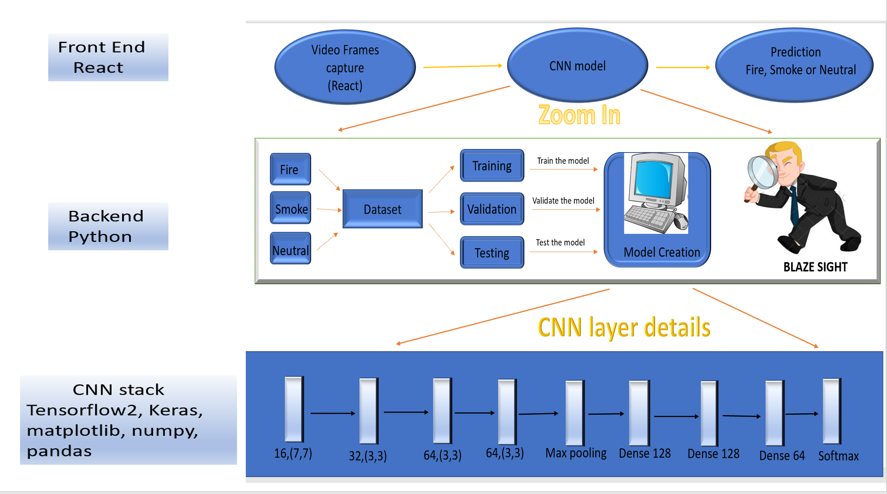
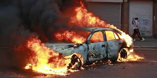
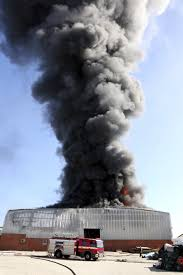
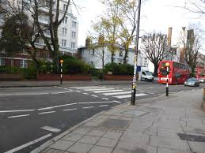
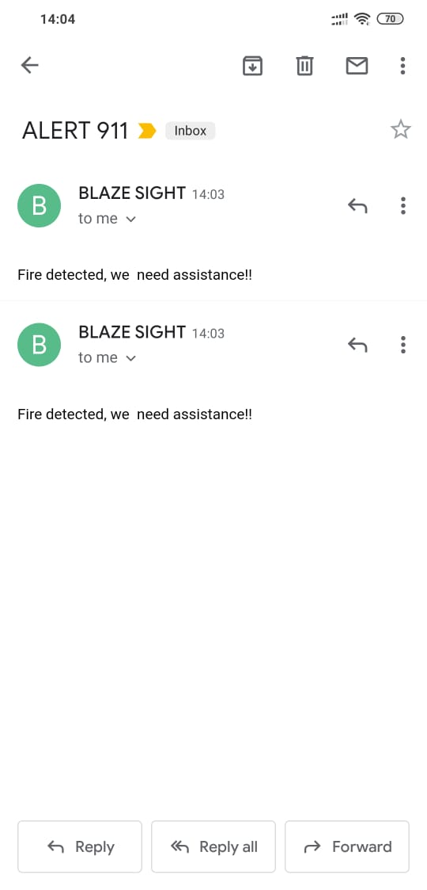
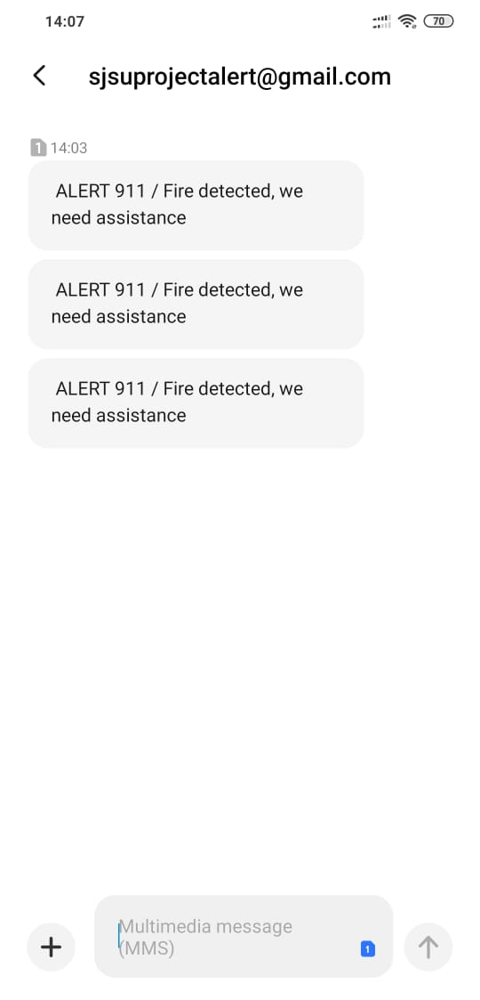

## Project Title ##  
Blaze Sight !  
(Video detection of fire for Large Scale Analystics data handling)

## Abstract ##
Fire safety has consistently been the piece of the most extreme significance in all regions over the globe. There are smoke alarms that have been embedded in all the potential spots to raise a crisis alert as ahead of schedule as could reasonably be expected. Nonetheless, there remains the extent of a downpour of events that are lethal and go unnoticed at the beginning phases. The result is shocking. Observing non-military personnel fire calamity announced by US Fire Association "1288 regular citizen home fire fatalities detailed by U.S. news media between January 1, 2020, and August 6, 2020". Withdrawing a year behind, in 2019, there was a huge fire misfortune in the Amazon woods. It wrecked 17 percent of the backwoods. This features the emergency that remaining parts undealt at places where alarms and smoke alarms can't be introduced at this point.

The current framework uses alarm hardware to raise a crisis and brisk call of activity. This has been a lot of help. Be that as it may, the current arrangement doesn't cover the open zones from forestalling any harm brought about by the blasting flares of fire.

Numerous researchers have distributed their attempts to catch the video outlines and distinguish if there is a fire situation using profound learning models. A significant test in the zone is to recognize among fire, smoke, and impartial situations. The plan is to guarantee the assurance from fire.
This project manages the execution of combined rationale from IEEE papers and self-decisions to build up a framework that catches recordings at the front end. It at that point breaks it into the little edges and passes it to the CNN model to distinguish the criticality of the circumstance. On the off chance that fire is seen in different sequential casings, it reports to the crisis administrations with a quick impact to battle the circumstance and re-establish regularity.

## Architecture Diagram ##

## Three defined classes for prediction ##

Fire

Smoke

Neutral

## Technology Stack ##
* 	Deep CNN to classify the input in one the three classes.
* 	Machine-Learning : Python 
* 	Keras for Deep Learning Model implementation
* 	Python Flask API.
*   Tensorflow2, matplotlib, numpy, pnadas
*   React

## Alert messages sent to 911 ##

Email

Text

